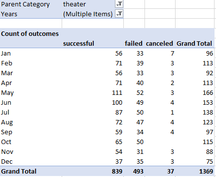
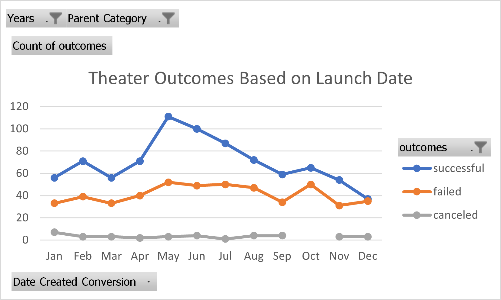
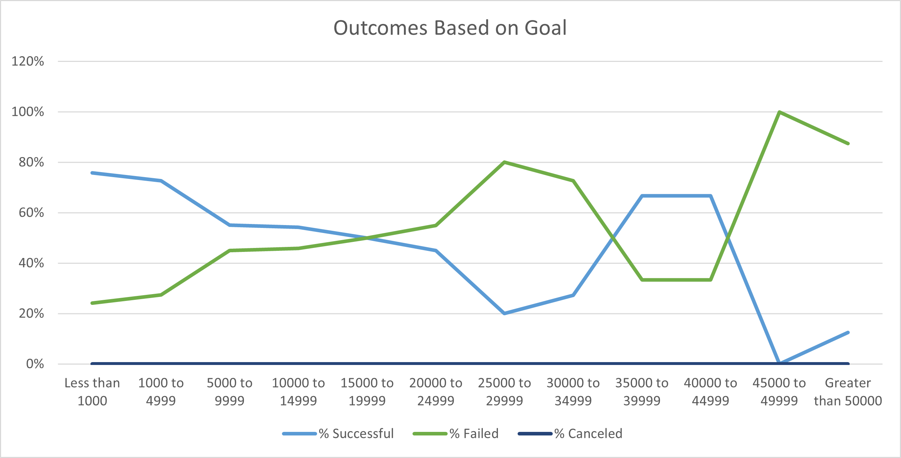

# Kickstarting with Excel
## Overview of Project  
An analysis of kickstarter data to uncover trends for theater (play) campaigns based on funding goal and also launch date.
## Purpose
The purpose of this project was analyze kickstarter campaigns for "Louise" to help Louise make an informed decision about her own campaign.  We narrowed the data to campaigns similar to our target campaign: theater projects with an emphasis on plays.  The analysis sought to answer the following two main questions:
1. Does the month that a campaign is launched affect how successful the kickstarter is?
2. Does the initial funding goal affect how successful the kickstarter is?
## Analysis and Challenges
The initial dataset included data on over four thousand crowdfunding campaigns from 2009-2017.  An analysis was done on the campaign data to categorize the data by outcome, country, funding goal, category and many others.  It was determined that several campaigns matched our target campaign of theater projects: plays. 
### Analysis of Outcomes Based on Launch Date
I created a pivot table based on the entire sheet of data filtering by Parent Category and Month:

After creating the pivot table, I created a line graph based on the information to display the number canceled, failed, live or successful campaigns based on the month the project launch.

### Analysis of Outcomes Based on Goals
To analyze outcomes based on goals, I used the `=countifs` command to create a count of projects based on funding goal and successful vs. failed outcomes.  
I then created a line graph to visualize the percentage of projects that were successful based on their initial funding goal.

### Challenges and Difficulties Encountered
The biggest challenge for me personally was realizing how little I know about Excel - just enough to be dangerous.  I enjoyed learning about Pivot Tables, and Vlookup - and can see how both will be very useful to me in the future.
Another big challenge for me was correcting my code in the Outcomes Based on Goals sheet.  
Initially I had the following:
`=COUNTIFS(Kickstarter!$D:$D,"<4999",Kickstarter!$D:$D,">1000",Kickstarter!$F:$F,"successful",Kickstarter!$R:$R,"plays")`

I could not figure out why my numbers were off until (embarrassingly) I went back to the original data and realized that I was missing all the campaigns that were *equal* to multiples of $5000.  I had to correct my code to:
`=COUNTIFS(Kickstarter!$D:$D,"<4999",Kickstarter!$D:$D,">=1000",Kickstarter!$F:$F,"successful",Kickstarter!$R:$R,"plays")`.  

As a math teacher, it will be a great example of the importance of equals!

## Results
- What are two conclusions you can draw about the Outcomes based on Launch Date?

The most successful month to kickoff a Play crowdfunding campaign is May. September and November have the fewest failed campaigns, but overall Play projects are successful endeavors.  There are very few canceled projects. 

- What can you conclude about the Outcomes based on Goals?

The highest percentage of successful campaigns are those less than $5000.  For projects between $5000 and $25000, only about half of campaigns are successful.  While campagns between $35000 and $45000 were 67% successful, there is a relatively low number of projects total in those goal ranges, so that data may not be reliable.

- What are some limitations of this dataset?

The dataset we were given included only crowdfunding project information from one crowdfunding site - kickstarter.  There are several other crowdfunding sites that are geared toward creative projects, and including that data as well would increase our dataset and reliability.  In addition, this dataset only has projects dating up to 2017.  Assuming this is a 'live' project, I imagine the data would tell quite a different story, especially for plays, since the beginning of 2020.

- What are some other possible tables and/or graphs that we could create?

In addition to analyzing data based on month of launch and total project goal, it would be interesting to analyze projects in the US versus other countries.  It would also be interesting to see what role the length of the campaign played in the success of a campaign.  Is there an optimal time between project launch and deadline for raising the most money?  Or the highest chance of success?  
It would also be interesting to see if the 'spotlight' feature affected how successful a campaign is.  If there is an additional cost to having your project 'spotlighted', it would be interesting to see if that is worth it.  Does it increase the odds of a successful campaign?  Does it increase the total funding percentage?

